# Pangu Agent-Safe Workflow 设计方案 v2.0

版本: v2.0  
日期: 2026-06-15  
状态: 已实现能力审视 + 下一版架构规划  
适用仓库: `Mas_API_cli`  
核心入口: `pangu-agent`

## 1. 版本说明

本文件是在上一版 agent-safe CLI 方案基础上的版本号 +1 设计文档。由于仓库中没有保存旧版设计文档，本文约定:

- v1.x: 当前已经落地的 `pangu-agent` 方案，包括场景化查询、状态机、审批门禁、目标边界、数据集发布等待、模型发布后资产解析等能力。
- v2.0: 本文提出的设计基线。它既记录当前实现，也给出架构层面的缺陷识别和下一步优化方向。

本文不是单纯的使用说明，而是面向工程演进的设计文档。它重点回答:

- 当前实现如何工作。
- agent 为什么更不容易乱猜命令。
- 训练、数据集、发布、部署之间的函数调用路径是什么。
- 已经实现了哪些保护。
- 当前还有哪些系统性缺陷。
- 下一步如何从可用方案演进为更稳定、可测试、可扩展的 agent workflow 平台。

## 2. 背景与目标

原始 `pangu` CLI 是面向人类操作者设计的命令集合。大模型 agent 直接调用原始 CLI 时，常见问题包括:

- 猜测不存在的命令参数。
- 不看 `--help`，凭经验拼接参数。
- 直接使用 UUID，而不是从查询结果中选择。
- 跳过用户确认，提交训练或部署任务。
- 将训练产物 `model_id` 当作部署所需 `asset_id`。
- 没有识别目标边界，训练后继续引导发布或部署。
- 在 `scaffold` 后跳过超参数展示，直接进入 validate 或 submit。
- 数据集发布是异步过程，发布请求返回不代表训练可用。

v2.0 的目标是将 `pangu-agent` 明确定位为 agent 专用的协议层，而不是原始 CLI 的简单包装。核心目标如下:

1. 限制 agent 的自由发挥空间，让它按结构化状态机执行。
2. 所有关键选择都来自查询结果的 index，不让 agent 手写 ID。
3. submit 类动作必须 validate 且必须用户确认。
4. 运行状态保存在本地 run state 中，跨多轮对话可继续。
5. 使用 `goal` 声明本次用户目标，达到目标后明确 `terminal: true`。
6. 对数据集、训练参数、发布资产、部署资源做前置校验。
7. 保持底层原始 CLI 可复用，不重写全部业务逻辑。

## 3. 当前架构总览

当前实现由三层组成:

- 原始 CLI 层: `pangu model/dataset/pool/training/service`。
- Agent 适配层: `pangu-agent`，位于 `src/pangu/agent_main.py` 和 `src/pangu/agent/*.py`。
- Skill 指令层: `.claude/skills/pangu-agent/SKILL.md`，约束 agent 如何调用。

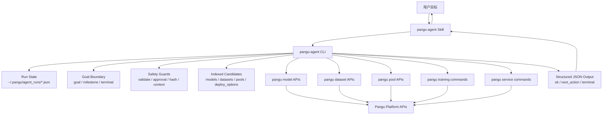

## 4. 代码模块职责

| 模块 | 职责 | 当前状态 |
| --- | --- | --- |
| `src/pangu/agent_main.py` | `pangu-agent` Typer 入口，串联 dataset/train/deploy workflow | 已实现，仍偏胖 |
| `src/pangu/agent/state.py` | run state 持久化、run_id 校验、artifact hash、GC | 已实现 |
| `src/pangu/agent/goals.py` | 目标边界、milestone 判定、`terminal` 输出 | 已实现 |
| `src/pangu/agent/candidates.py` | 候选列表压缩、分页、page-size 上限 | 已实现 |
| `src/pangu/agent/datasets.py` | 数据集 ready 校验、publish request id 提取 | 已实现 |
| `src/pangu/agent/training_context.py` | 训练 YAML 与选择上下文一致性校验 | 已实现 |
| `src/pangu/agent/training_params.py` | 超参数列出、索引选择、`--param` 覆盖校验 | 已实现 |
| `src/pangu/agent/approval.py` | 训练提交、部署提交、模型发布的确认/审批摘要 | 已实现 |
| `src/pangu/agent/published_assets.py` | 发布模型后从资产中心解析 `asset_id` | 已实现 |
| `src/pangu/agent/scenarios.py` | 内置 CV 场景配置 | 已实现，需外部化 |
| `src/pangu/agent/utils.py` | JSON 输出、错误包装、`run_quietly` | 已实现，需重构 |
| `.claude/skills/pangu-agent/SKILL.md` | Agent 操作规约 | 已实现，存在与代码漂移风险 |

## 5. 关键设计原则

### 5.1 Agent 只操作协议，不操作底层实现

Skill 中明确要求 agent 只使用 `pangu-agent`，不直接调用原始 `pangu model`、`pangu dataset`、`pangu training`、`pangu service`。这样可以把校验、分页、审批、目标边界都放在协议层。

### 5.2 查询结果索引化

模型、数据集、资源池、部署选项统一返回 `index`。后续选择使用:

- `--model <index>`
- `--dataset <index>`
- `--pool <index>`
- `--option <index>`
- `--source <index>`

这避免 agent 手写 UUID 或从历史上下文里复用旧 ID。

### 5.3 Validate before Submit

训练和部署都采用:

```text
scaffold -> params/validate -> approval -> submit
```

核心保护:

- validate 成功后记录 artifact hash。
- submit 前重新校验 artifact hash。
- validate 后 YAML 改动会导致 submit 失败。
- submit 前需要用户明确 approve。

### 5.4 Goal-bound Workflow

每个 run 有 `goal`:

- `dataset_ready`
- `training_submitted`
- `training_completed`
- `model_published`
- `deployment_submitted`
- `service_running`

达到目标后，输出:

```json
{
  "goal_reached": true,
  "terminal": true,
  "next_action": "stop"
}
```

这可以防止 agent 在“只训练”的任务中继续发布或部署。

### 5.5 完整参数展示是训练提交前置条件

`train scaffold` 后必须展示完整参数列表:

```text
train scaffold -> train params -> train validate
```

实现上:

- `train scaffold` 返回 `parameters`、`parameter_count`、`params_command`，并将 `next_action` 指向 `train.params`。
- `train params` 记录 `params_listed=true` 和 `params_artifact_hash`。
- `train validate` 检查参数是否已经针对当前 YAML 展示过。
- 如果没有展示或 YAML 已变更，validate 返回 `training_params_not_listed` 或 `training_params_stale`。

## 6. Run State 数据模型

Run state 存储在 `~/.pangu/agent_runs/<run_id>.json`。

核心字段:

```json
{
  "schema_version": 1,
  "run_id": "training_20260615_120000",
  "kind": "training",
  "scenario": "cv_image_classification",
  "goal": "training_submitted",
  "env_type": "HCS",
  "workspace_id": "...",
  "created_at": "...",
  "expires_at": "...",
  "artifacts": {
    "train_yaml": "..."
  },
  "validate_success": false,
  "artifact_hash": "",
  "models": [],
  "datasets": [],
  "pools": [],
  "selection": {},
  "training_context": {},
  "params_listed": false,
  "params_artifact_hash": ""
}
```

设计收益:

- 多轮对话中 agent 不需要重新猜上下文。
- index 选择和原始候选绑定。
- validate/submit 使用同一份 artifact。
- 可以判断上下文是否过期或不一致。

当前风险:

- state 明文保存，可能包含 OBS 路径、资产名、任务名。
- schema_version 目前没有迁移机制。
- 并发写入没有文件锁。

## 7. Workflow 状态机与时序图

本节提供可直接查看的 SVG 图片，同时保留 Mermaid 源码，便于后续维护和重新渲染。图片生成脚本位于 `docs/diagrams/render_pangu_agent_diagrams.py`。

### 7.1 顶层状态机

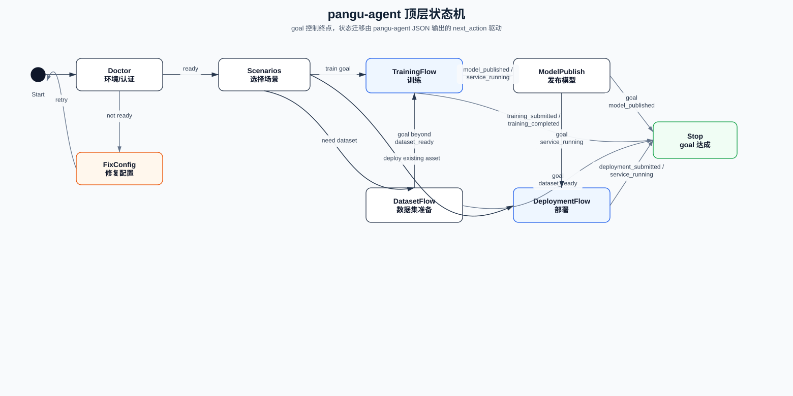

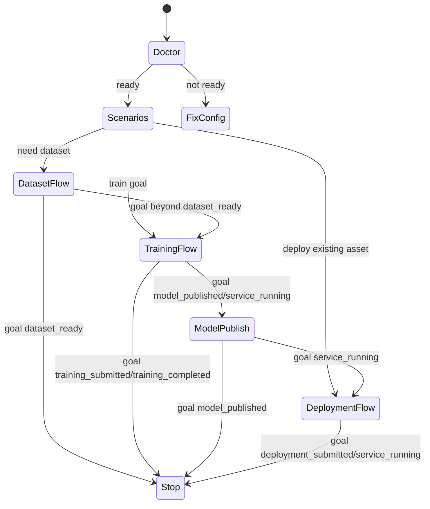

### 7.2 数据集发布时序图

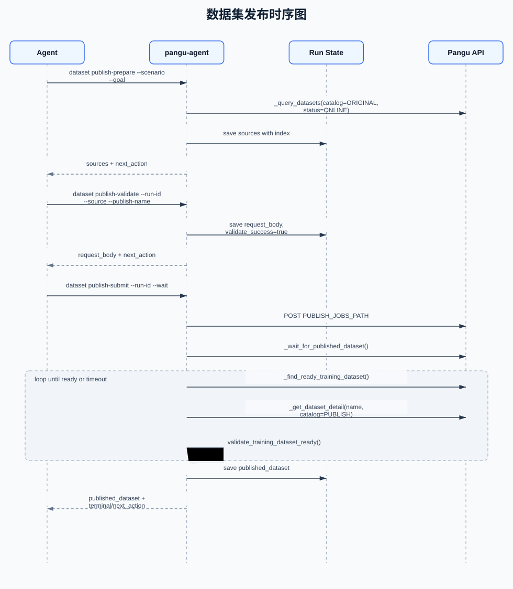

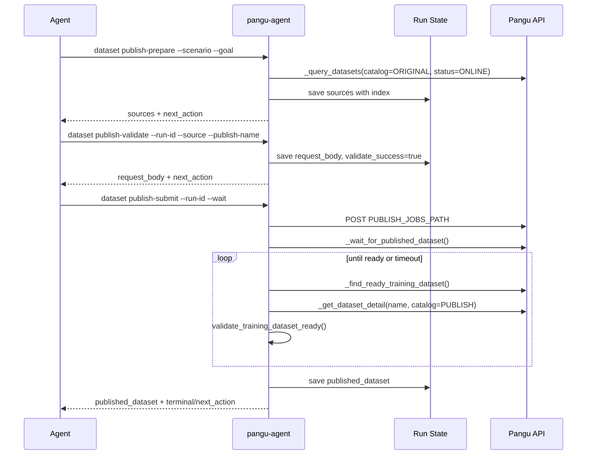

关键设计:

- 发布请求 ID 只作为诊断信息，不作为训练 ready 信号。
- 训练 ready 信号是 v1 detail 接口查询到 `catalog=PUBLISH` 且 `status=ONLINE`。

### 7.3 训练流程时序图

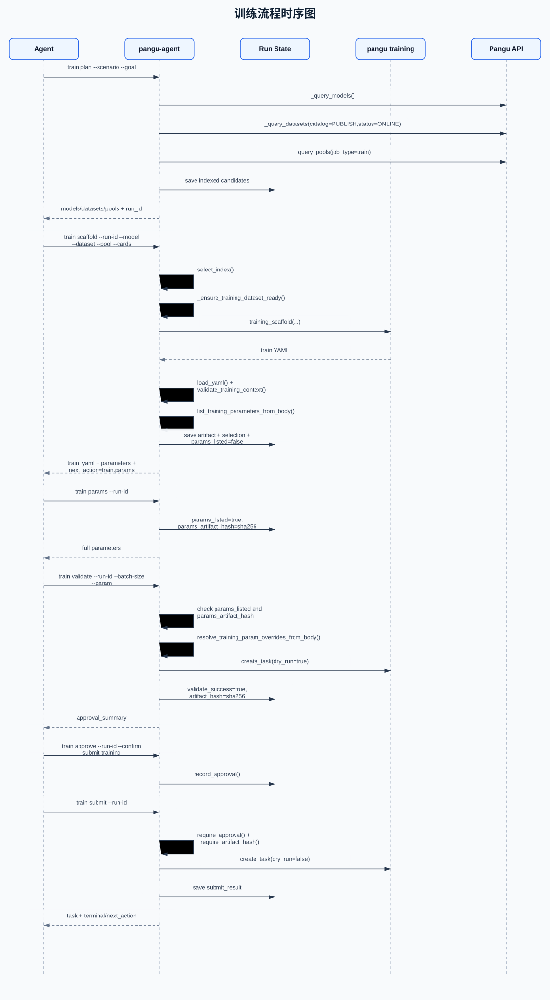

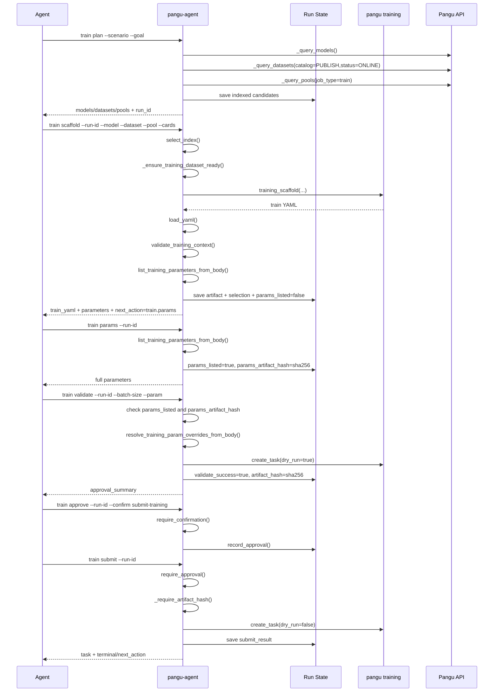

### 7.4 模型发布与部署资产解析时序图

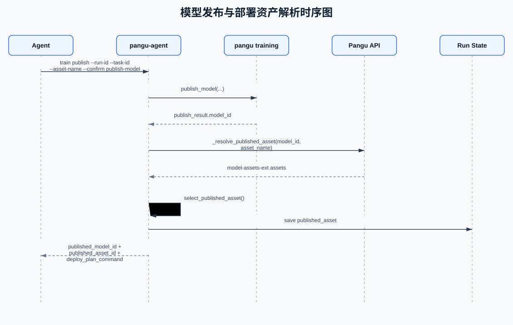

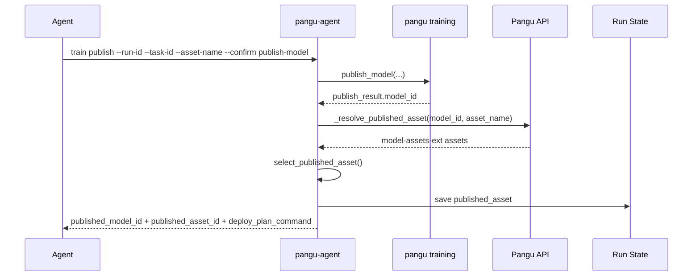

关键设计:

- 发布接口返回的是训练模型 `model_id`。
- 部署需要的是资产中心 `asset_id`。
- `pangu-agent` 不允许把 `model_id` 当作 `--asset-id`。
- 如果资产中心存在延迟，agent 应运行 `train published-assets` 重试解析。

### 7.5 部署流程时序图

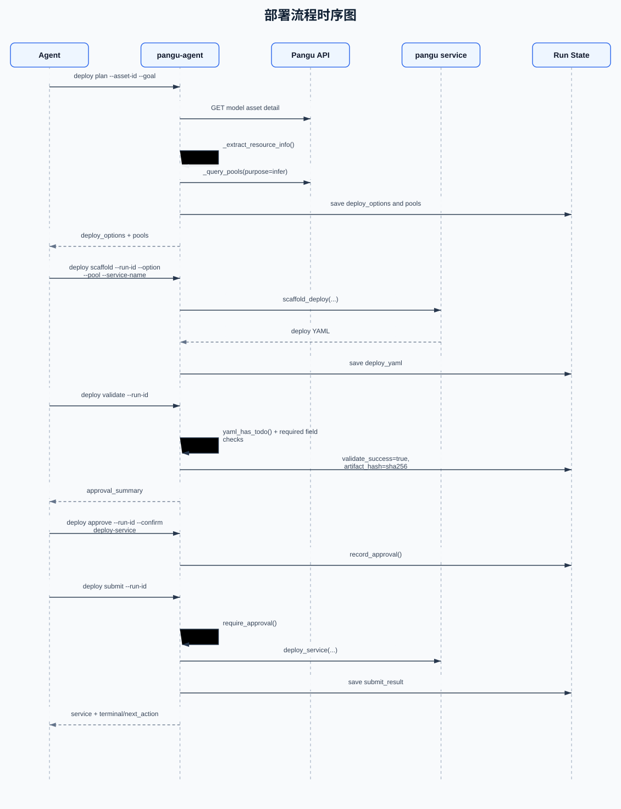

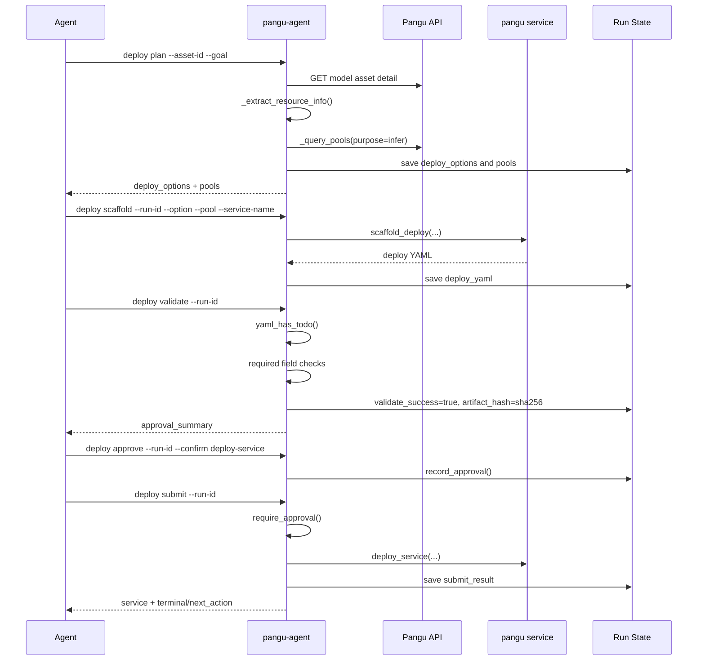

## 8. 函数调用路径清单

### 8.1 通用输出路径

```text
Typer command
  -> _emit(factory)
    -> factory()
    -> success(**payload)
    -> print_json()

AgentError
  -> failure(error)
  -> { ok:false, code, message, next_action, details }
```

相关函数:

- `pangu.agent.utils.success`
- `pangu.agent.utils.failure`
- `pangu.agent.utils.print_json`
- `pangu.agent.errors.AgentError`

### 8.2 Goal 输出路径

```text
command handler
  -> with_goal_next_action(state, payload, milestone, continue_action)
    -> goal_from_state(state)
    -> goal_reached(goal, milestone)
    -> next_action = "stop" if reached else continue_action
```

相关函数:

- `pangu.agent.goals.normalize_goal`
- `pangu.agent.goals.goal_from_state`
- `pangu.agent.goals.goal_reached`
- `pangu.agent.goals.with_goal_next_action`

### 8.3 候选分页路径

```text
train plan / dataset list / deploy plan
  -> candidate_page(kind, rows, page, page_size)
    -> normalize_page_size(page_size)
    -> compact_candidate(kind, row)
  -> page_metadata(kind, rows, page, page_size)
```

关键约束:

- `--page-size` 只控制展示，不扩大后端查询范围。
- `MAX_PAGE_SIZE = 50`。
- 后端查询范围通过 `--limit` 控制，目前 agent 默认可用到 1000。

### 8.4 数据集 ready 校验路径

```text
_ensure_training_dataset_ready(client, workspace_id, scenario, dataset_row)
  -> _find_ready_training_dataset(client, workspace_id, scenario, dataset_id, name)
    -> _get_dataset_detail(client, workspace_id, name, catalog=PUBLISH)
    -> validate_training_dataset_ready(detail, scenario)
    -> fallback: _query_datasets(...)
    -> find_matching_dataset(...)
    -> validate_training_dataset_ready(match, scenario)
```

设计理由:

- 用户验证过 `pangu dataset get <name> -c PUBLISH` 能看到 `ONLINE`。
- 因此 publish wait 和 train precheck 优先走 detail 语义，而不是只依赖 publish job。

### 8.5 训练参数路径

```text
train scaffold
  -> training_scaffold(...)
  -> load_yaml(artifact)
  -> list_training_parameters_from_body(body)
  -> state.params_listed=false
  -> next_action=train.params

train params
  -> load_yaml(artifact)
  -> validate_training_context(state, body)
  -> list_training_parameters_from_body(body)
  -> state.params_listed=true
  -> state.params_artifact_hash=sha256

train validate
  -> check params_listed
  -> check params_artifact_hash == current sha256
  -> resolve_training_override_from_body(batch_size)
  -> resolve_training_param_overrides_from_body(--param)
  -> create_task(dry_run=true)
```

### 8.6 发布资产解析路径

```text
train publish
  -> publish_model(...)
  -> publish_result.model_id
  -> _resolve_published_asset(model_id, asset_name)
    -> published_asset_query(asset_name, current_workspace=true)
    -> client.get(MODEL_EXT_PATH, params)
    -> flatten_asset_ext(item)
    -> select_published_asset(assets, model_id, asset_name)
  -> published_asset_id
  -> deploy_plan_command
```

## 9. 当前已实现能力

### 9.1 Agent 安全协议

已实现:

- `pangu-agent` 独立入口。
- 所有主要 workflow 返回 JSON。
- 错误统一为 `AgentError(code, message, next_action, details)`。
- Skill 明确禁止调用原始 `pangu` 命令。

### 9.2 场景化工作流

已实现:

- `cv_image_classification`
- `cv_object_detection`
- `cv_semantic_segmentation`

每个场景内置:

- 模型查询条件。
- 数据集 modal/content_type。
- 数据集 import/publish 参数。
- 训练 model_type/train_type/model_source。
- batch size 参数候选名。

### 9.3 数据集治理

已实现:

- 训练数据集必须 `catalog=PUBLISH`。
- 训练数据集必须 `status=ONLINE`。
- 发布等待以 PUBLISH detail 为 ready 信号。
- 发布请求 id 仅作为诊断，不作为 ready 信号。

### 9.4 训练上下文原子性

已实现:

- 模型、数据集、资源池、cards 组成训练上下文。
- 更换任意一个都必须重新 scaffold。
- validate/submit 前校验 YAML 与 selection 一致。

### 9.5 超参数治理

已实现:

- `train params` 列出真实 YAML 参数。
- `--param` 支持 index 或 name。
- 保护参数 `train_flavor` 不允许通过 `--param` 覆盖。
- validate 前强制当前 YAML 已展示过参数。
- submit 只能复用 validate 阶段的参数覆盖。

### 9.6 用户确认与审批

已实现:

- `train approve --confirm submit-training`
- `train publish --confirm publish-model`
- `deploy approve --confirm deploy-service`

训练和部署 submit 还会校验 artifact hash。

### 9.7 目标边界

已实现:

- `--goal` 写入 run state。
- 输出 `goal`、`milestone`、`goal_reached`、`terminal`。
- 达到目标后 `next_action=stop`。

### 9.8 发布模型到部署资产转换

已实现:

- `publish_result.model_id` 被明确标记为训练模型 ID。
- 通过 `model-assets-ext` 解析发布后的 `asset_id`。
- 输出 `published_asset_id` 和 `deploy_plan_command`。
- Skill 禁止将 `model_id` 当作部署 `asset_id`。

### 9.9 测试覆盖

当前已有测试文件:

- `test_agent_approval.py`
- `test_agent_candidates.py`
- `test_agent_datasets.py`
- `test_agent_goals.py`
- `test_agent_published_assets.py`
- `test_agent_scenarios.py`
- `test_agent_state.py`
- `test_agent_training_context.py`
- `test_agent_training_params.py`

主要覆盖:

- 状态文件路径安全。
- 候选分页。
- 数据集 ready 校验。
- goal stop/continue 逻辑。
- 发布资产选择。
- scenario schema。
- 训练上下文一致性。
- 训练参数解析与覆盖。
- 审批摘要。

## 10. 严谨审视: 当前缺陷与风险

### 10.1 `agent_main.py` 职责过重

现状:

- `agent_main.py` 同时承担 CLI 入口、流程编排、API 查询、状态更新、部分业务判断。
- 文件已经偏大，维护成本上升。

风险:

- 新增 workflow 时容易继续堆叠。
- 单元测试难以隔离编排逻辑。
- 容易出现参数与 skill 不一致。

建议:

- 拆分 service 层:
  - `DatasetWorkflowService`
  - `TrainingWorkflowService`
  - `DeploymentWorkflowService`
  - `PublishedAssetResolver`
- Typer handler 只负责参数解析和输出。

### 10.2 `run_quietly + extract_first_json` 是最大技术债

现状:

- agent 层复用原始 Typer command，通过 stdout 捕获和 JSON 提取拿结果。

风险:

- Rich console 输出和 JSON 可能混杂。
- Typer command 内部异常语义不适合被当作服务函数复用。
- 如果原始命令增加交互确认，agent 可能卡住。
- 输出格式调整会破坏 agent 层解析。

建议:

- 抽取底层业务 service 函数，返回 Python dict。
- 原始 CLI 和 agent CLI 都调用 service 函数。
- `run_quietly` 仅保留为过渡兼容层。

优先级: P0。

### 10.3 Scenario 硬编码

现状:

- 场景写死在 `scenarios.py`。

风险:

- 新增图像分类、物体检测以外的场景需要改代码。
- 用户自定义场景无法通过配置完成。
- schema 校验只覆盖必要字段，无法表达更复杂能力。

建议:

- 支持 `~/.pangu/agent_scenarios/*.yaml`。
- 使用 JSON Schema 或 Pydantic 校验。
- 每个 scenario 增加:
  - model query profile
  - dataset import/publish profile
  - training param mappings
  - resource constraints
  - deployment preferences

优先级: P1。

### 10.4 Submit 幂等性不足

现状:

- state 中会记录 submit_result，防止同一 run 重复 submit。
- 但如果网络超时发生在服务端已提交、客户端未写 state 之前，重试可能重复提交。

风险:

- 重复 import/publish/train/deploy。
- 重复任务消耗资源。

建议:

- 为每次 submit 生成 client_request_id。
- 如果后端支持幂等 key，透传给后端。
- 如果后端不支持，提交前后用名称、时间、request_body hash 做幂等查询。
- state 写入采用 pending/submitted 两阶段。

优先级: P0/P1，取决于后端能力。

### 10.5 参数列表可能仍受工具输出截断影响

现状:

- `train scaffold` 和 `train params` 都会返回参数列表。
- 但如果模型参数极多，agent 工具输出仍可能截断。

风险:

- agent 以为已经看到全量参数，但实际输出被上层工具截断。
- 用户追问后才查全。

建议:

- 对训练参数也增加分页:
  - `pangu-agent train params --run-id <id> --page 1 --page-size 50`
  - `pangu-agent train param-get --run-id <id> --index <n>`
  - 输出 `parameter_pages.has_more`。
- 同时输出 `parameter_count` 和 `next_page_command`。
- validate 前要求如果 `has_more=true`，agent 必须翻页或用户指定参数 index。

优先级: P1。

### 10.6 发布资产解析存在最终一致性窗口

现状:

- `train publish` 后立即查 `model-assets-ext`。
- 如果查不到，提示 `train published-assets` 重试。

风险:

- 发布接口成功，但资产中心延迟可见。
- agent 可能提前判断没有资产。

建议:

- 增加 `train published-assets --wait --timeout --interval`。
- 将 `asset_resolution.resolved=false` 和 `next_action=wait_or_retry_train.published-assets` 标准化。
- 支持按 `asset_name` 精确查和按 `model_id` 查的多轮重试。

优先级: P1。

### 10.7 状态文件安全与并发

现状:

- run state 使用 0600 权限。
- 没有加密。
- 没有文件锁。

风险:

- 本地敏感路径和参数明文。
- 多个 agent 同时操作同一 run_id 时可能覆盖。

建议:

- 对 state 增加文件锁。
- 增加 state schema migration。
- 敏感字段脱敏或可选加密。
- 记录 `updated_at`、`revision`，写入前检查 revision。

优先级: P2。

### 10.8 Skill 与代码漂移

现状:

- skill 是手写 Markdown。
- CLI 参数变更后需要人工同步。

风险:

- 之前已经出现过 `scaffold -> validate` 与 skill `scaffold -> params -> validate` 不一致。

建议:

- 为 `pangu-agent` 生成机器可读 command spec。
- 在测试中校验 skill 示例命令是否能被 Typer 解析。
- 建立 golden workflow 文档测试。

优先级: P1。

### 10.9 集成测试不足

现状:

- 当前测试主要是纯函数和局部行为。
- 没有完整 fake PanguClient 的端到端 workflow 测试。

风险:

- 函数调用路径变化可能不被测试发现。
- API 响应字段变化后只在真实环境暴露。

建议:

- 引入 FakePanguClient。
- 覆盖:
  - dataset publish wait
  - train plan/scaffold/params/validate/approve/submit
  - publish model -> resolve asset_id
  - deploy plan/scaffold/validate/approve/submit
- 对所有 JSON 输出做 contract snapshot。

优先级: P0/P1。

## 11. v2.0 目标架构优化方案

### 11.1 分层架构

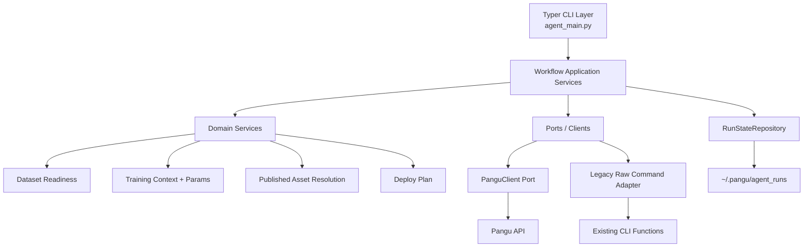

设计原则:

- CLI handler 不做复杂业务，只做参数绑定。
- Application service 负责 workflow 编排。
- Domain service 负责纯业务判断，便于单测。
- Port/adapter 负责访问 Pangu API 或兼容旧 CLI。
- StateRepository 负责持久化、锁、迁移。

### 11.2 目标目录建议

```text
src/pangu/agent/
  app/
    dataset_workflow.py
    training_workflow.py
    deployment_workflow.py
  domain/
    datasets.py
    training_params.py
    training_context.py
    published_assets.py
    goals.py
  infrastructure/
    state_repository.py
    pangu_client_port.py
    legacy_command_adapter.py
  presentation/
    json_contracts.py
    errors.py
```

迁移策略:

1. 保留现有命令签名，避免破坏用户使用。
2. 先把 `_query_*`、`_wait_*`、`_resolve_*` 从 `agent_main.py` 移出去。
3. 再把 command handler 改为调用 service。
4. 最后逐步替换 `run_quietly`。

## 12. 测试工程方案

### 12.1 测试金字塔

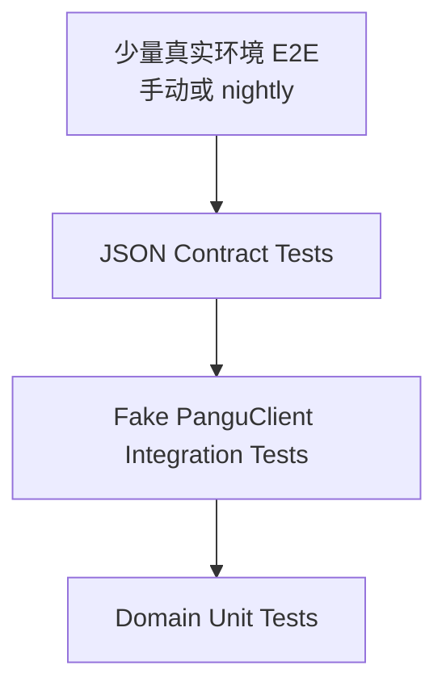

### 12.2 单元测试

继续保持:

- goals 判定。
- state 路径和权限。
- candidate pagination。
- training params。
- training context。
- published asset selection。
- dataset ready validation。

新增建议:

- `train validate` 必须依赖 params_listed。
- `params_artifact_hash` 变化时 validate 失败。
- `published_asset_id` 解析失败时 next_action 正确。

### 12.3 集成测试

引入 `FakePanguClient`，覆盖完整流程:

```text
dataset publish -> wait ready -> train plan -> scaffold -> params -> validate -> approve -> submit
```

以及:

```text
train completed -> publish -> model-assets-ext delay -> retry -> deploy plan
```

### 12.4 Contract 测试

对所有 agent 命令输出约束:

- 必须有 `ok`。
- 成功 workflow 输出必须有 `next_action`。
- goal run 输出必须有 `goal`、`goal_reached`、`terminal`。
- 错误输出必须有 `code`、`message`、`next_action`。
- submit 前输出必须有 `approval_required` 或已记录 approval。

### 12.5 Skill 示例测试

从 `SKILL.md` 提取命令块，至少验证:

- 参数名存在。
- 必填参数示例完整。
- 不包含已废弃参数。

## 13. 异步 Monitor 扩展方案

### 13.1 设计目标

数据导入和数据集发布等待通常是短等待，可以保留 `--wait`。训练和推理部署不同，耗时可能很长，不应由 agent 主会话持续轮询。异步 Monitor 的目标是:

1. 训练/部署提交后，主会话显式创建一个外部 monitor 任务。
2. monitor 以独立进程运行，不占用 agent 主会话。
3. monitor 复用现有 `pangu-agent train status` / `pangu-agent deploy status` 查询状态。
4. 到终态后，调用可插拔三方 agent adapter。
5. adapter 使用对应 agent SDK，向来源 `session_id` 对应会话发送一条用户消息。
6. 原会话收到消息后，继续按照 skill 执行下一阶段。

Monitor 不做 workflow 编排，不自动发布模型、不自动部署、不自动 approve。它只负责“长等待结束后，把事件送回来源会话”。

### 13.2 与现有逻辑的衔接点

衔接点放在 submit 成功之后，保持显式两步:

```text
train/deploy submit
  -> 保存 submit_result 到 run state
  -> 返回 task_id/service_id、status_command、monitor_add_template

skill
  -> 如果目标超过 submitted milestone
  -> 提供 session_id
  -> 执行 pangu-agent monitor add --run-id <run_id> ... --detach
  -> 主会话停止等待

monitor runner
  -> 从 monitor task 读取 status_command
  -> 循环执行 status command
  -> 到终态后调用 adapter.send_message(...)
```

具体复用点:

- `train submit`: 已保存 `submit_result`，新增返回 `task_id` 和 `monitor_add_template`。
- `deploy submit`: 已保存 `submit_result`，新增返回 `service_id` 和 `monitor_add_template`。
- `monitor add`: 只接收 `run_id`，从 run state 读取真实 `task_id` / `service_id`，不让 agent 手填任务 ID。
- `monitor run`: 复用 status command，而不是重写 Pangu API 查询逻辑。
- skill: submit 后负责显式调用 `monitor add --detach`，只提供 `session_id`；adapter 来自 `--adapter`、`PANGU_MONITOR_ADAPTER` 或 `pangu config monitor_adapter`，默认值为 `codeagent`。

### 13.3 流程图

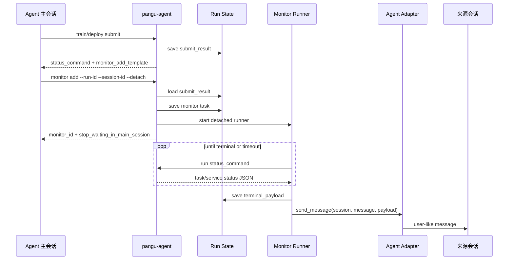

### 13.4 MonitorTask 数据模型

Monitor task 存储在 `~/.pangu/agent_monitors/<monitor_id>.json`。

```json
{
  "schema_version": 1,
  "monitor_id": "monitor_training_20260617_120000",
  "kind": "training",
  "run_id": "training_20260617_115900",
  "target_id": "task_abc",
  "status_command": [
    "pangu-agent",
    "train",
    "status",
    "--run-id",
    "training_20260617_115900",
    "--task-id",
    "task_abc",
    "--json"
  ],
  "adapter": "codeagent",
  "session": {
    "session_id": "sess_123"
  },
  "success_message": "训练任务已完成，请继续下一步。",
  "failure_message": "训练任务已结束但未成功，请检查失败原因。",
  "interval_seconds": 60,
  "timeout_seconds": 86400,
  "max_delivery_attempts": 8,
  "monitor_status": "watching",
  "delivery_status": "pending"
}
```

`session_id` 是通用会话主键，由 adapter 使用。为保持协议简单，Monitor 通用层只要求这一项会话信息。

### 13.5 命令设计

创建训练 monitor:

```bash
pangu-agent monitor add \
  --run-id training_xxx \
  --session-id sess_123 \
  --detach \
  --json
```

创建部署 monitor:

```bash
pangu-agent monitor add \
  --run-id deployment_xxx \
  --session-id sess_123 \
  --detach \
  --json
```

adapter 不由 agent 猜测，解析顺序为:

1. `--adapter` 显式传入，仅用于调试或人工覆盖。
2. `PANGU_MONITOR_ADAPTER` 环境变量。
3. `pangu config` 中的 `monitor_adapter`。

示例配置:

```bash
pangu config set monitor_adapter codeagent
```

辅助命令:

```bash
pangu-agent monitor run --monitor-id <monitor_id> --json
pangu-agent monitor list --json
pangu-agent monitor status --monitor-id <monitor_id> --json
pangu-agent monitor cancel --monitor-id <monitor_id> --json
pangu-agent monitor retry-delivery --monitor-id <monitor_id> --json
pangu-agent monitor message --monitor-id <monitor_id> --json
```

### 13.6 状态查询与终态判断

第一版 monitor 复用 CLI，不直接查 Pangu API:

```text
training:
  pangu-agent train status --run-id <run_id> --task-id <task_id> --json

deployment:
  pangu-agent deploy status --run-id <run_id> --service-id <service_id> --json
```

终态规则:

| 类型 | 成功终态 | 失败终态 | 继续等待 |
| --- | --- | --- | --- |
| training | `completed` | `failed`, `stopped` | 其他状态 |
| deployment | `running` | `failed`, `stopped` | 其他状态 |

### 13.7 三方 Agent Adapter 接口

Monitor 不关心三方 agent 如何发送消息，只调用统一接口:

```python
class AgentAdapter:
    name = "base"
    required_session_fields = ("session_id",)

    def send_message(self, session: dict, message: str, payload: dict) -> None:
        raise NotImplementedError
```

明确 SDK 对接样例:

```python
from pangu.agent_monitor.adapters.base import AgentAdapter
from vendor_agent_sdk import VendorAgentClient


class VendorAgentAdapter(AgentAdapter):
    name = "vendor_agent"
    required_session_fields = ("session_id",)

    def __init__(self) -> None:
        self.client = VendorAgentClient.from_env()

    def send_message(self, session: dict, message: str, payload: dict) -> None:
        self.validate_session(session)
        self.client.sessions.send_message(
            session_id=session["session_id"],
            content=message,
            metadata={
                "source": "pangu-agent-monitor",
                "run_id": payload.get("run_id"),
                "kind": payload.get("kind"),
                "target_id": payload.get("target_id"),
                "terminal_status": payload.get("terminal_status"),
                "next_action": payload.get("next_action"),
            },
        )
```

通用 webhook adapter 适用于支持 HTTP callback 的 agent 平台:

```json
{
  "session_id": "sess_123",
  "url": "https://agent.example.com/callback",
  "headers": {
    "Authorization": "Bearer <token>"
  }
}
```

```bash
pangu-agent monitor add \
  --run-id training_xxx \
  --session-json '{"session_id":"sess_123","url":"https://agent.example.com/callback"}' \
  --adapter webhook \
  --detach \
  --json
```

### 13.8 投递失败处理

任务终态和消息投递分离:

```text
monitor_status: completed / failed / stopped / timeout
delivery_status: pending / retrying / delivered / failed
```

终态检测成功后，monitor 先保存 `terminal_payload`，再尝试 `send_message`。如果 SDK 客户端关闭、会话不可用、认证过期或网络失败:

1. 按有限次数重试。
2. 重试失败后写入 `~/.pangu/agent_monitor_dead_letters/<monitor_id>.json`。
3. `delivery_status=failed`。
4. 用户可使用 `monitor retry-delivery` 改投递目标，或用 `monitor message` 导出消息手动发送。

这样保证“任务结果不丢，自动回写尽力而为，失败后可人工恢复”。

### 13.9 新增与修改清单

新增:

- `src/pangu/agent_monitor/models.py`: monitor task 数据模型。
- `src/pangu/agent_monitor/store.py`: monitor JSON 存储和 dead-letter。
- `src/pangu/agent_monitor/status.py`: 从 run state 生成 status command，判断终态。
- `src/pangu/agent_monitor/runner.py`: 外部循环、终态落盘、投递重试。
- `src/pangu/agent_monitor/adapters/base.py`: adapter 接口。
- `src/pangu/agent_monitor/adapters/codeagent.py`: 默认 `codeagent` 适配器模板。
- `src/pangu/agent_monitor/adapters/example_sdk.py`: 三方 SDK 示例 adapter。
- `src/pangu/agent_monitor/adapters/webhook.py`: 通用 webhook adapter。
- `pangu-agent monitor add/run/list/status/cancel/retry-delivery/message`。

修改:

- `train submit`: 返回 `task_id` 和 `monitor_add_template`。
- `deploy submit`: 返回 `service_id` 和 `monitor_add_template`。
- `SKILL.md`: submit 后目标超过 submitted 时创建 detached monitor，不在主会话轮询。
- 设计文档: 增加异步 Monitor 方案、状态投递模型和 adapter 接入方法。

不修改:

- 不改变 validate / approval / submit 的门禁。
- 不让 monitor 自动 publish / deploy / approve。
- 不让 `pangu-agent` 猜 session。
- 不替代现有 `train status` / `deploy status`。
- 数据导入和数据集发布短等待保持现状。

## 14. 下一步路线图

### P0: 稳定性修复

1. 为 `train params` 增加分页，避免参数列表被工具截断。
2. 用 FakePanguClient 补齐完整 workflow 集成测试。
3. 重构 `run_quietly` 的最高风险路径，优先训练和部署 submit。
4. 发布资产解析增加 `--wait`，解决资产中心最终一致性。
5. 为 async monitor 增加真实三方 agent adapter 的集成测试。

### P1: 架构重构

1. 从 `agent_main.py` 抽出 workflow service。
2. 外部化 scenario 配置。
3. 建立 JSON contract 测试。
4. 建立 skill 示例命令测试。
5. 增加 submit 幂等机制。
6. 增加 monitor delivery 的可观测性和清理策略。

### P2: 平台化能力

1. run state 加锁和 schema migration。
2. 敏感字段脱敏或加密。
3. 命令执行事件日志。
4. workflow replay/debug 工具。
5. 自动生成 skill 或 command reference。

## 15. 验收标准

v2.0 后续优化完成时，应满足:

- Agent 不直接调用原始 `pangu` 命令。
- Agent 不猜参数，不猜 ID。
- 任意 submit 前都有 validate 和 approval。
- 训练前数据集一定是 PUBLISH/ONLINE。
- 训练前完整参数已展示，且 validate 使用同一 YAML。
- 发布后部署使用 `asset_id`，不是 `model_id`。
- 只训练、只部署、完整链路都受 `goal` 控制。
- 长训练/部署等待由 detached monitor 接管，不占用主会话。
- 所有关键路径有 FakePanguClient 集成测试。
- Skill 示例命令能被自动校验。

## 16. 结论

当前 `pangu-agent` 已经从“给 agent 的命令包装器”演进为“有状态、有目标边界、有审批门禁的 agent workflow 协议层”。它已经解决了 agent 乱猜参数、跳过确认、数据集未 ready、发布模型 ID 与部署资产 ID 混淆、跳过超参数展示等关键问题。

但从架构师和测试工程视角看，当前方案仍处在 v1.x 到 v2.0 的过渡阶段。最大的技术债是 `agent_main.py` 过重、`run_quietly` 复用 CLI 输出脆弱、集成测试不足、scenario 硬编码和 submit 幂等性不足。下一步应优先把 workflow 编排从 CLI handler 中抽离，并补齐 FakePanguClient 集成测试和 JSON contract 测试。这样才能让后续场景扩展、命令变更和真实环境异常都可控。
